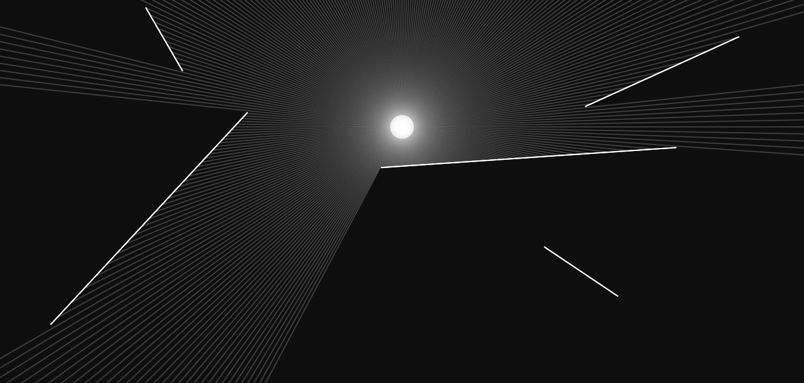

# Raycasting
A project made by following the [Coding Train's Video](https://youtu.be/TOEi6T2mtHo) on raycasting.

I learned about vectors and how raycasting works.

### Github page
https://jinkang-0.github.io/Raycasting/